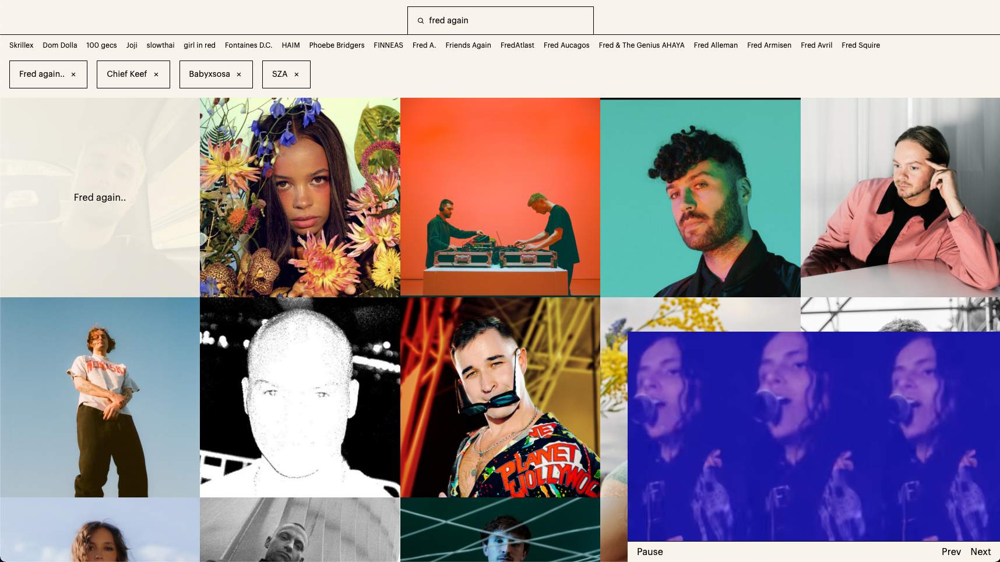

# goat.fm

A visual music discovery platform.



## Running locally

To run the client:

```sh
cd client
yarn
```

To run the web server locally, you will need to generate a Spotify client secret. You can do this through the [developer dashboard](https://developer.spotify.com/dashboard/applications). Then you can run:

```sh
cd server
yarn
SPOTIFY_SECRET=<your-spotify-client-secret> yarn dev
```

## TODO

- Integrate last.fm API
- Persist YouTube search results to minimise API requests

## Stack

- vite: Development tooling
- Express: Web server
- React: JS library
- TypeScript: Programming language
- Tailwind: CSS framework
